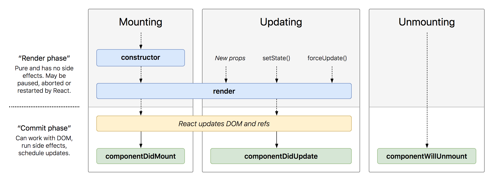
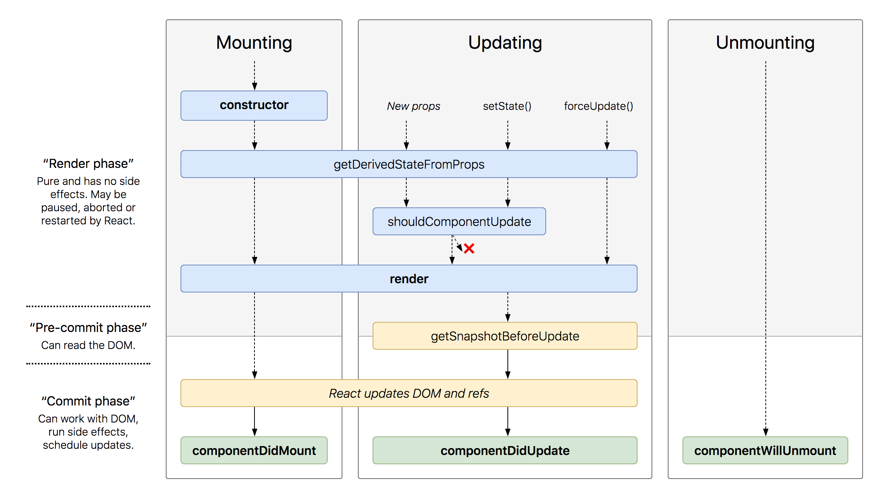

# Lifecycle Methods

Lifecycle methods are custom functionality that gets executed during the different phases of a component. There are methods available when the component gets created and inserted into the DOM (mounting), when the component updates, and when the component gets unmounted or removed from the DOM.

> ## Mounting
>
> The main job of React is to figure out how to modify the DOM to match what the components want to be rendered on the screen.
>
> React does so by "mounting" (adding nodes to the DOM), "unmounting" (removing them from the DOM), and "updating" (making changes to nodes already in the DOM).
>
> This process of creating instances and DOM nodes corresponding to React components, and inserting them into the DOM, is called mounting.

#### React Lifecycle Methods Diagram: Common Methods



> Here is an interactive version that links to the documentation for each method: [React Lifecycle Methods Diagram](http://projects.wojtekmaj.pl/react-lifecycle-methods-diagram/)

## Using LifeCycle Methods

In applications with many components, it’s very important to free up resources taken by the components when they are destroyed.

We want to set up a timer whenever the Clock is rendered to the DOM for the first time. This is called “mounting” in React.

We also want to clear that timer whenever the DOM produced by the Clock is removed. This is called “unmounting” in React.

We can declare special methods on the component class to run some code - when a component mounts : - set up a timer to refresh the clock every second - when a component unmounts: - tear down the timer when the component is removed to prevent a memory leak

```diff
class Clock extends React.Component {
  state = {
    time: new Date().toLocaleTimeString()
  };

  refresh = () => {
    this.setState({ time: new Date().toLocaleTimeString() });
  };

  render() {
    return (
      <div>
        <p>{this.state.time}</p>
-        <button onClick={this.refresh}>Refresh</button>
      </div>
    );
  }

+  componentDidMount() {
+    this.timerID = setInterval(this.refresh, 1000);
+  }

+  componentWillUnmount() {
+    clearInterval(this.timerID);
+  }

}

ReactDOM.render(<Clock />, document.getElementById('root'));
```

<!-- #### React Lifecycle Methods Diagram: All Methods

 -->

## Reference

[React Lifecycle Methods Diagram](http://projects.wojtekmaj.pl/react-lifecycle-methods-diagram/)

[Glossary: Lifecycle Methods](https://reactjs.org/docs/glossary.html#lifecycle-methods)

[What is Mounting?](https://stackoverflow.com/questions/31556450/what-is-mounting-in-react-js/31559566#31559566)
